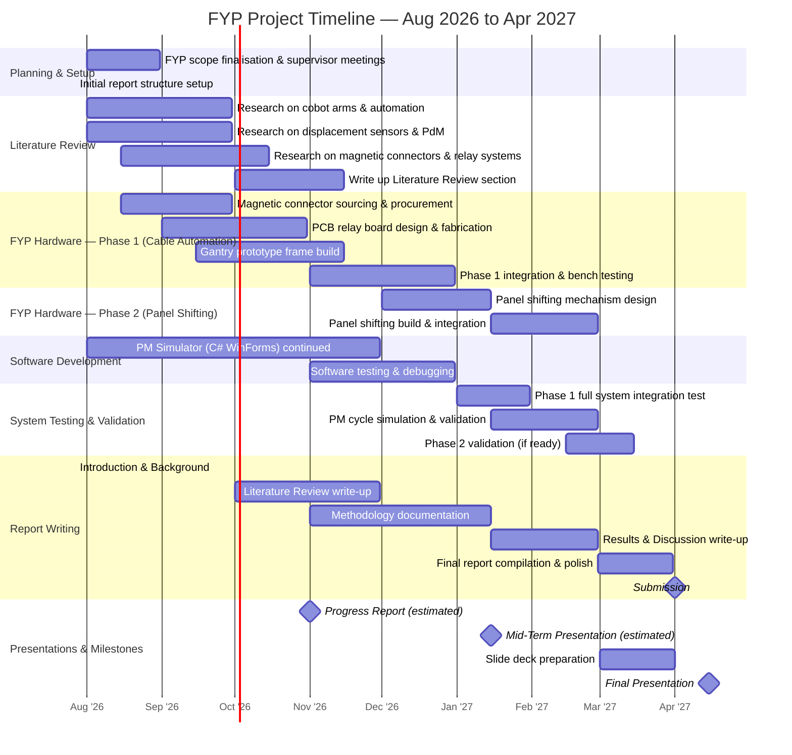

# Automating Preventive Maintenance for OHT Obstacle Detection Sensors in a Semiconductor Fab Environment

**Author:** Tan Yi Rong
**Matriculation Number:** U2320967K
**Supervisor:** [To Be Added]
**School / Programme:** [To Be Added]
**Company:** GlobalFoundries Singapore
**Department:** F7 Automated Material Handling System (AMHS)
**Academic Year:** 2026/2027
**Submission Date:** [To Be Added]

---

## Acknowledgements

_To be written._

---

## Abstract

This report documents the feasibility study and phased automation approach for a Final Year Project (FYP) conducted in collaboration with GlobalFoundries Singapore's F7 Automated Material Handling System (AMHS) department. The project aims to automate the highly manual Preventive Maintenance (PM) workflow for Overhead Hoist Transport (OHT) Mark 2 obstacle detection sensors. By evaluating hardware alternatives, the project pivots from an expensive vision-based robotic solution to a cost-effective mechanical redesign using self-aligning magnetic connectors. This report covers the problem statement, the engineering design alternatives considered, the three-phase automation roadmap, and the projected return on investment for the recommended solution.

---

## Table of Contents

_To be generated upon completion._

---

## List of Figures

_To be added._

---

## List of Tables

_To be added._

---

## 1. Introduction

### 1.1 Background

GlobalFoundries operates an extensive Automated Material Handling System (AMHS) in its F7 fabrication facility. The Overhead Hoist Transport (OHT) fleet moves wafers across the cleanroom automatically, running continuously throughout production. Keeping these vehicles in good working order requires regular Preventive Maintenance carried out by the line support team, the technicians responsible for day-to-day maintenance and servicing of the OHT fleet.

A significant challenge identified was the manual, judgment-dependent process used to verify the OHT obstacle detection sensors. The root cause of inefficiencies in this process is an over-reliance on individual technician execution, which introduces variability and inconsistency into what should be a standardised safety procedure. This project lays out a phased automation roadmap to eliminate manual steps and standardize the sensor PM workflow.

### 1.2 Problem Statement

The PM process for the OHT Mark 2 obstacle detection sensors is one of the more involved maintenance tasks that the line support team handles. This PM is critical from a safety standpoint. The sensors being tested are responsible for detecting obstacles in the OHT's path and triggering the vehicle to stop before any collision occurs. Getting the PM right matters.

The sensors covered in each PM cycle are the Vehicle Detection Sensor (VHL) and three obstacle sensors, which are OBS Left, OBS Right and OBS Center.

The current process works as follows. Line support connects a data cable to the first sensor port and opens the Hokuyo application on a laptop to view the sensor's live waveform reading. Based on what they see on screen, they assess whether the sensor is within the acceptable operating range. If it is within spec, they take a screenshot of the waveform and document it. If it is not, they manually adjust the physical position of the sensor and recheck until the reading is within range. If the sensor cannot be brought into spec even after adjustment, it is swapped out for a replacement unit and the verification is repeated from the start.

This is done for each of the four sensors in turn, which means the data cable has to be physically unplugged from one port and plugged into the next, repeatedly across the session. On top of this, line support also has to manually shift a panel or reflective plate in front of each sensor to simulate an obstacle being present, then check that the sensor correctly registers the detection, before shifting the panel away again to confirm the sensor clears. This is done to verify both the detection and non-detection states for each sensor.

Each full PM cycle takes around one hour per OHT and the team handles about four OHTs per day. The process is effective, but the reliance on individual technician judgment, both in reading the waveform and in shifting the panel, introduces variability. Whether a waveform is "within spec" depends on the person looking at it and the consistency of panel positioning from one technician to the next is not guaranteed. 

### 1.3 Project Objectives

_To be written._

### 1.4 Scope and Limitations

_To be written._

### 1.5 Report Organisation

_To be written._

### 1.6 Project Timeline

The FYP runs from August 2026 to April 2027. The timeline below outlines the planned phases, milestones and report writing schedule across the full duration.

| Phase | Period | Key Deliverable |
|---|---|---|
| Planning & Setup | Aug 2026 | Confirmed scope and supervisor-approved plan |
| Literature Review | Aug – Nov 2026 | Written Literature Review section in report |
| FYP Phase 1 Hardware | Aug – Dec 2026 | Working cable plug-in/out prototype |
| FYP Phase 2 Hardware | Dec 2026 – Feb 2027 | Panel shifting mechanism |
| Software Development | Aug – Dec 2026 | PM Simulator complete |
| System Testing | Jan – Mar 2027 | Validated end-to-end PM cycle |
| Report Writing | Ongoing | Full draft ready by end of March 2027 |
| Final Presentation | Apr 2027 | Slides and live demo |

---

## 2. Design Alternatives & Feasibility Analysis

Before finalizing the architecture for the automated PM testing station, several design alternatives were evaluated. The core challenge was finding a reliable way for a robotic system to connect a data cable to the OHT sensor ports without human intervention.

### 2.1 The Initial Approach: Vision-Guided Robotics

The first proposed solution was to deploy a high-end Collaborative Robot (cobot) equipped with an advanced vision system, such as the OMRON TM5S. The reasoning was that the existing OHT sensor connection uses a complex 4-pin plug that requires precise alignment to insert correctly. A basic robot arm operating purely on coordinates would fail to make the connection if the OHT was parked even a few millimeters out of position. A camera-equipped robot could dynamically locate the port and adjust its insertion angle on the fly.

However, this approach presented two major constraints:
1. **Cost:** A vision-equipped cobot like the OMRON TM5S costs upwards of SGD 100,000 to 150,000. This is prohibitively expensive for automating a single step in a PM workflow.
2. **Alignment Complexity:** Even with a camera, inserting a tight-tolerance 4-pin plug is mechanically difficult and prone to jamming, which could damage the ports on the OHT fleet.

### 2.2 The Second Iteration: Custom 40-Pin Flange Tray

To get around the issue of plugging in multiple individual cables, a secondary approach was considered: creating a non-magnetic, custom 4x 10-pin port tray. This tray would act as an end-effector flange held directly by the cobot, designed to interface with all four sensor ports simultaneously. 

While this seemed efficient in theory, it introduced an even tighter mechanical constraint. Aligning a total of 40 pins simultaneously into their respective female ports requires extremely accurate, perfectly vertical upward positioning from the cobot. Any slight misalignment or angular deviation during insertion would risk bending or shearing the delicate male pins. Given the restrictive capabilities and high cost of deploying a sufficiently advanced vision system to guarantee this precision, this alternative was ultimately deemed too risky for the fleet's hardware.

### 2.3 The Pivot: Hardware Retrofit & Magnetic Connectors

Rather than throwing expensive robotics at a difficult connection problem, a better alternative was identified. By redesigning the connection interface itself, the complexity of the robotic task could be drastically reduced.

The new proposal involves retrofitting the entire OHT fleet with a single, centralised 15-pin magnetic connector (e.g., Rosenberger or HytePro). Because magnetic connectors are self-aligning, they naturally snap into the correct position when brought into close proximity. 

This alternative completely removes the need for a robotic vision system. A low-cost, "blind" cobot (such as the ABB GoFa or PoWa, which cost around SGD 20,000) only needs to move the cable to a rough coordinate. The magnets handle the final millimeter-perfect alignment. 

To account for the fact that a single port now handles all four sensors, a custom PCB relay board is introduced at the testing station. This board acts as an automated switchbank, cycling the data connection through the VHL, OBS Left, OBS Right and OBS Center sensors sequentially without requiring the cobot to physically unplug and replug the cable.

This alternative is vastly superior. It drops the robotics cost by over SGD 100,000, eliminates the risk of bending pins in the data ports and simplifies the software architecture.

### 2.4 Vision System Evaluation (SICK Robot Guidance)

Even with the magnetic plug handling the fine, millimeter-perfect alignment, a coarse vision guidance system is still required to navigate the robotic arm to the general vicinity of the OHT port. Two smart vision systems from SICK were evaluated: the 1.2MP PLOC2D-611-6RB and the 5.1MP PLOC2D-8305-12. 

While the 5.1MP model offers extreme precision (0.11mm accuracy), it is priced at roughly SGD 7,000. In contrast, the 1.2MP model provides 0.23mm accuracy for SGD 3,900. Because the selected magnetic connectors have an inherent mechanical "snap" capture zone of several millimeters, the 0.23mm accuracy of the 1.2MP camera is more than sufficient. Choosing the lower-resolution camera avoids over-engineering and saves the project roughly SGD 3,100 per station without compromising reliability.

### 2.5 Iterative Prototyping Strategy (De-Risking)

A major engineering risk identified early in the project is signal integrity: verifying that the Hokuyo sensor waveform data can survive crossing a magnetic pogo-pin gap and a relay switchbank without dropping packets. 

To mitigate financial risk before purchasing the high-value ABB PoWa cobot, a low-cost bench prototype was mandated. Rather than waiting for custom Printed Circuit Boards (PCBs) to be manufactured, the initial test utilizes raw perfboards. Furthermore, LED indicators were integrated into the circuit. These serve as a critical diagnostic tool to verify the logic control, providing visual confirmation of which sensor channel is active before moving to the final, professional custom PCB deployment for the 304-vehicle fleet.

### 2.6 System Architecture & Signal Switching Logic

To ensure extreme scalability across the 304-vehicle fleet, the hardware architecture was deliberately split into two distinct halves:
1. **The OHT Side (Passive):** The four sensor cables on the vehicle are routed into a completely passive breakout PCB that terminates into a single magnetic socket. There are no "smart" electronics on the vehicle, making the fleet retrofit incredibly cheap and eliminating software maintenance on the OHTs.
2. **The Workstation Side (Active):** The cobot holds the magnetic plug. The cable runs from the plug down to an active switching PCB containing the ESP32 microcontroller and the switching logic, which interfaces with the laptop. All complex logic is centralized here.

During the design of the Active Switching Board, mechanical relays were initially considered to route the four sensor signals. However, they were ultimately rejected due to the risk of "contact bounce"—a phenomenon where physical metal contacts bounce microscopically upon closing, which would shred the sensitive Hokuyo data waveform into noise. 

Instead, the design pivoted to utilize an **Analog Multiplexer / IC Switch** (e.g., CD4052). Because IC switches have zero moving parts, they route the data signal cleanly and instantly. Additionally, due to the high electromagnetic interference (EMI) present in a semiconductor fabrication plant, shielded cables and copper ground planes were mandated for the active board to ensure pristine signal integrity.

---

## 3. Methodology

### 3.1 Phased Automation Approach

Rather than trying to automate everything at once, the project adopts a phased approach that addresses the most impactful manual steps first and builds towards a fully integrated solution over time.

**Phase 1 — Automate the Cable Plug-In/Out**

The first phase focuses on using a Collaborative Robot (cobot) arm to handle the physical plugging and unplugging of the data cable, utilizing the new magnetic connector logic. This is the most repetitive mechanical action in the PM workflow and is a prime candidate for automation. The cobot moves the magnetic plug to the designated coordinate on the OHT, where it snaps into place, holds the connection while the PM Simulator captures the readings via the relay board, and then disconnects.

Automating this specific step is estimated to remove roughly 10 minutes from each PM cycle. At four OHTs per day and 208 working days per year, that adds up to approximately 416 technician hours saved annually.

**Phase 2 — Automate the Panel Shifting**

The second phase tackles the manual panel shifting that line support currently does to simulate obstacle detection. This involves moving a reflective plate or panel in and out of the sensor's field of view to verify that each sensor correctly registers the presence and absence of an obstacle. Automating this step requires a motorised or actuator-driven mechanism that can reliably position the panel at the correct location and angle for each sensor test, then retract it again.

This phase has more mechanical complexity than Phase 1, which is why it comes second. Getting the cable connection automated and validated first provides a stable foundation before adding the panel actuation on top.

**Phase 3 — Integrated Stationary Workstation**

Phase 3 is the end state. It brings together the cobot arm, the panel shifting mechanism and the waveform verification into a single integrated workstation. The idea is that line support would bring an OHT to the station, connect it up and then step through the PM sequence by pressing a button at each stage. The system handles the physical actions and the technician's role shifts from doing the manual work to supervising and confirming each step.

This removes the judgment dependency from the process and creates a consistent, repeatable PM workflow that produces standardised documentation automatically at the end of each session.

---

## 4. Results and Discussion

### 4.1 Cost Analysis and Recommended Path

The estimated retrofit cost for the full fleet of 304 vehicles to implement the magnetic connector solution:

| Component | Unit Cost | Total (304 OHTs) |
|---|---|---|
| Rosenberger 15-pin Magnetic Plug (Premium) | ~SGD 70 | ~SGD 21,280 |
| Standard Pogo-Pin Plug (Budget) | ~SGD 4 | ~SGD 1,216 |
| Custom PCB Bridge Board | ~SGD 3 | ~SGD 912 |
| **Grand Total — Premium Route** | | **~SGD 22,192** |
| **Grand Total — Budget Route** | | **~SGD 2,128** |

One-time retrofit labour at ~SGD 24.34/hr (AE rate based on USD 45k/yr, 4-day 12-hour swing shift): ~SGD 7,344 for 304 OHTs at 1 hour each. Estimated rollout: 2.5 to 4 months at 4 to 6 OHTs per day.

The recommended approach is a budget-friendly ABB cobot (~SGD 20k) combined with the budget magnetic plug retrofit (~SGD 2,128) and a custom PCB relay board, bringing the total estimated investment to around SGD 30k. This is roughly one-fifth the cost of the OMRON vision-guided option for the same functional outcome in Phase 1.

From an ROI standpoint, the system is projected to recover approximately SGD 10,100 in direct manpower costs per year (416 hrs × SGD 24.34/hr), giving a payback period of around three years. Beyond the direct savings, the automation removes the risk of port damage from repeated manual connections, eliminates waveform reading inconsistency between operators and lays the groundwork for Phases 2 and 3 of the full PM automation roadmap.

### 4.2 Discussion

_To be written._

---

## 5. Conclusion and Recommendations

The feasibility study confirms that automating the sensor PM process is viable at a justifiable cost. Phase 1, the cobot arm for cable plug-in/out, is the immediate focus with the magnetic plug retrofit acting as the critical enabling hardware change. From there, Phase 2 (panel shifting automation) and Phase 3 (integrated workstation) provide a clear path towards a fully streamlined, technician-supervised PM workflow that is consistent, documented and scalable across the fleet.

---

## References

_To be added. Use IEEE citation format._

---

## Appendices

### Appendix A — [To Be Added]

_To be added._
